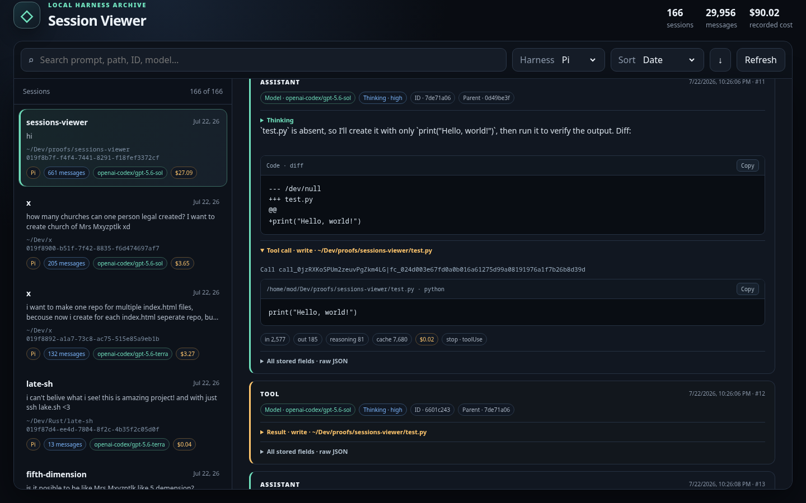

# Session Viewer

A local, read-only web viewer for coding-agent session archives.

Built-in extensions support [Pi](https://github.com/badlogic/pi-mono) and Codex. The viewer normalizes both formats into one searchable timeline while retaining the original records as expandable raw JSON.



## Features

- Select between installed session harnesses
- Search by prompt, path, session ID, model, or thinking mode
- Sort by date, project path, or session ID
- Show model, provider, and thinking mode on every event
- Display token usage, cache usage, cost when available, timestamps, IDs, and file metadata
- Render file writes as code, edits and patches as diffs, and shell calls as commands
- Show multi-agent message type, task path, sender, and recipient
- Keep tool calls, tool results, skills, reasoning, and raw JSON collapsed until requested
- Preserve harness-specific fields in expandable raw JSON
- Link directly to a harness and session
- Responsive desktop and mobile layout

## Built-in harnesses

| Harness | Session directory | Default |
| --- | --- | --- |
| Pi | `~/.pi/agent/sessions` | Yes |
| Codex | `~/.codex/sessions` | No |

Only the selected harness is scanned. Results are cached until **Refresh** is clicked. Codex archives store token usage but not monetary cost, so the viewer reports **Not stored** instead of inventing an estimate.

## Requirements

- Node.js 18 or newer
- At least one supported session directory

No package installation, template compiler, or build step is required.

## Run

```bash
node server.js
```

Open <http://127.0.0.1:4173>.

Harness-aware deep links use this format:

```text
http://127.0.0.1:4173/#pi/019f8b7f-f4f4-7441-8291-f18fef3372cf
http://127.0.0.1:4173/#codex/SESSION_ID
```

Bare `#SESSION_ID` links open with whichever installed extension declares `default: true`.

## Configuration

| Environment variable | Default | Purpose |
| --- | --- | --- |
| `PORT` | `4173` | Local HTTP port |
| `PI_SESSIONS_DIR` | `~/.pi/agent/sessions` | Pi session directory |
| `CODEX_SESSIONS_DIR` | `~/.codex/sessions` | Codex session directory |

Example:

```bash
PORT=8080 CODEX_SESSIONS_DIR=~/archives/codex node server.js
```

## Add a harness extension

Every enabled JavaScript file in `extensions/` is loaded as trusted local code. An extension implements two operations behind one interface:

```js
module.exports = {
  enabled: true,
  default: false,
  id: 'my-harness',
  label: 'My Harness',
  defaultRoot: '~/.my-harness/sessions',
  rootEnv: 'MY_HARNESS_SESSIONS_DIR',

  async listSessions({ root }) {
    return { sessions: [], errors: [] };
  },

  async loadSession({ root, id }) {
    return { summary: {}, events: [], parseErrors: [] };
  },
};
```

Copy `extensions/custom-example.js`, implement the two methods, and set `enabled: true`. Extensions may use JSONL, SQLite, or any other local format, but must normalize data into the viewer's shared `summary` and `events` shape.

The server and browser contain no harness IDs or harness event/tool names. Extensions normalize their records into generic events (`title`, `summary`, `display`) and message content primitives such as `text`, `context`, `toolCall`, `toolResult`, `command`, `code`, `diff`, and `fileChange`. Adding a harness therefore requires only an extension file.

Extensions execute with the same filesystem permissions as the server. Install only code you trust.

## Tests

With Node.js:

```bash
node server.test.js
```

With Bun:

```bash
bun test server.test.js
```

Use `bun test`, not `bun run`: Bun must start its test runner for the `node:test` API.

## Files

| File | Purpose |
| --- | --- |
| `server.js` | Extension discovery, scan cache, and local HTTP routes |
| `page.html` | Static application shell |
| `public/app.js` | Harness selector and normalized timeline renderer |
| `public/style.css` | Responsive interface styling |
| `extensions/pi.js` | Pi adapter |
| `extensions/codex.js` | Codex adapter |
| `extensions/custom-example.js` | Disabled extension template |
| `extensions/index.js` | Trusted extension discovery and validation |
| `lib/jsonl.js` | Shared tolerant JSONL reading and recursive discovery |
| `server.test.js` | Pi, Codex, extension, page, and stylesheet checks |

## Privacy

Session files can contain prompts, source code, command output, paths, and tool results. The viewer:

- listens only on localhost;
- reads but never modifies session files;
- makes no external network requests;
- uses only Node.js built-ins at runtime.
